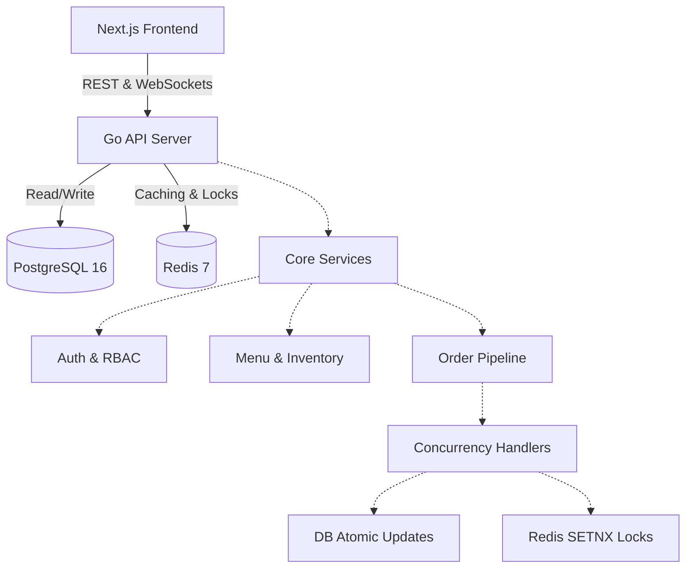

# OrderFlow 🍔

> A scalable, multi-vendor food ordering platform built for high concurrency.
> 
> [**Live Demo**](#) | [**API Documentation**](#swagger-openapi-docs)


---

## 📸 Preview

*(Placeholder for Screenshot/GIF of the Customer and Vendor Dashboards in action)*

---

## 🏗️ Architecture



---

## 🧠 Key Engineering Decisions

### 1. Concurrency Control (The "Overselling" Problem)
When multiple customers attempt to purchase a limited-stock item simultaneously, standard read-modify-write cycles lead to race conditions and negative inventory.

**Solution**: OrderFlow implements two defensive strategies that can be toggled:
- **Atomic Database Updates**: `UPDATE menu_items SET stock_qty = stock_qty - $2 WHERE id = $1 AND stock_qty >= $2`. This leverages Postgres' internal row locking to guarantee stock never drops below zero, even under massive concurrent load.
- **Distributed Redis Locks**: Uses Redis `SETNX` with a TTL as a fast-path mutex to serialize requests before they hit the database, reducing DB contention.

### 2. Safe Idempotency
Network instability often causes clients to retry `POST /api/v1/orders`. 
- **Solution**: Every order request requires a unique `Idempotency-Key` header. A unique constraint in Postgres guarantees that retried requests are safely intercepted, preventing duplicate charges.

### 3. Real-Time Tracking
- **Solution**: Gorilla WebSockets broadcast real-time order status updates from the Vendor to the Customer seamlessly.

---

## 🚀 Setup & Installation

Running the entire stack locally is incredibly simple.

### Prerequisites
- [Docker Desktop](https://www.docker.com/products/docker-desktop/) installed and running.

### 1. Clone & Configure
```bash
git clone https://github.com/Samruddhi-7/orderflow.git
cd orderflow
cp .env.example .env
```

### 2. Spin up the Stack
```bash
docker-compose up --build -d
```
This single command will:
1. Start a PostgreSQL database and run all schema migrations automatically.
2. Start a Redis cache.
3. Build the Go API into an optimized, multi-stage Alpine Docker image and expose it on `http://localhost:8080`.

### 3. Run the Frontend (Optional)
```bash
cd web
npm install
npm run dev
```
Access the frontend at `http://localhost:3000`.

---

## 🧪 Testing

The codebase includes rigorous unit and integration tests.

### What's Covered?
- **Integration (testcontainers-go)**: The `TestOrderConcurrency` test spins up a real Postgres database and fires 100 concurrent goroutines to purchase a single low-stock item, actively proving the overselling protections work.
- **Unit (Auth & RBAC)**: Verifies JWT token generation, parsing, and role-based access control middleware.

### Run Tests
Make sure Docker is running (required for `testcontainers-go`), then execute:
```bash
go test -v ./...
```

---

## ⚡ Performance & Load Testing

A k6 load test simulating 100 concurrent virtual users (VUs) placing orders against the same menu item for 30 seconds validated that the atomic-DB-update overselling protection works correctly under real contention — not just in a controlled integration test.

| Metric | Value |
|--------|-------|
| Requests/sec | 98.7 |
| p50 latency | 952 ms |
| p95 latency | 1,323 ms |
| p99 latency | 2,141 ms |
| Error rate | 0% |
| Total orders created | 3,078 |
| Stock oversold? | **No** — final stock (6,922) = initial (10,000) − 3,078 |

Stock consistency was verified by querying `menu_items.stock_qty` after the run: every decrement was accounted for and no negative stock occurred. See [`load-tests/README.md`](./load-tests/README.md) for the full scenario, command, and interpretation.

> **Caveat**: Tested against a local PostgreSQL instance with the rate limiter disabled. Production numbers under real network conditions, TLS termination, and concurrent multi-item requests would differ.

---

## 📊 Observability (Prometheus Metrics)

OrderFlow exposes a Prometheus-compatible `/metrics` endpoint with both HTTP-level and business-level instrumentation:

- **`http_requests_total`** — request count partitioned by method, route path, and status code.
- **`http_request_duration_seconds`** — latency histogram (enables p50/p95/p99 derivation from live data).
- **`orders_created_total`** — counter of successfully placed orders.
- **`order_creation_errors_total{reason="..."}`** — failed order attempts by reason (`validation_failed`, `insufficient_stock`, `lock_failed`, `db_error`).
- **`active_goroutines`** — gauge sampled on scrape, tied to the project's concurrency story.

### View locally

```bash
curl http://localhost:8080/metrics | grep -E "(orders_created|http_requests_total|active_goroutines)"
```

Example output:

```
# HELP active_goroutines Current number of active goroutines (sampled on scrape).
# TYPE active_goroutines gauge
active_goroutines 10
# HELP http_requests_total Total number of HTTP requests handled...
# TYPE http_requests_total counter
http_requests_total{method="POST",path="/api/v1/orders",status_code="201"} 1
orders_created_total 1
order_creation_errors_total{reason="validation_failed"} 2
```

This endpoint uses standard Prometheus exposition format and can be scraped by a Prometheus server and visualised in Grafana in a full production setup.

---

## 🛠 Before you commit

To ensure your code passes CI, a pre-commit hook has been added to `.git/hooks/pre-commit`. 

If you bypass the hook, or want to run linting manually, make sure you use the exact version of `golangci-lint` used in CI (v1.64.2).
Run the following command locally to verify zero errors before committing:
```bash
golangci-lint run ./...
```

---

## 📖 Swagger/OpenAPI Docs

*(Placeholder for Swagger UI / OpenAPI documentation link)*
